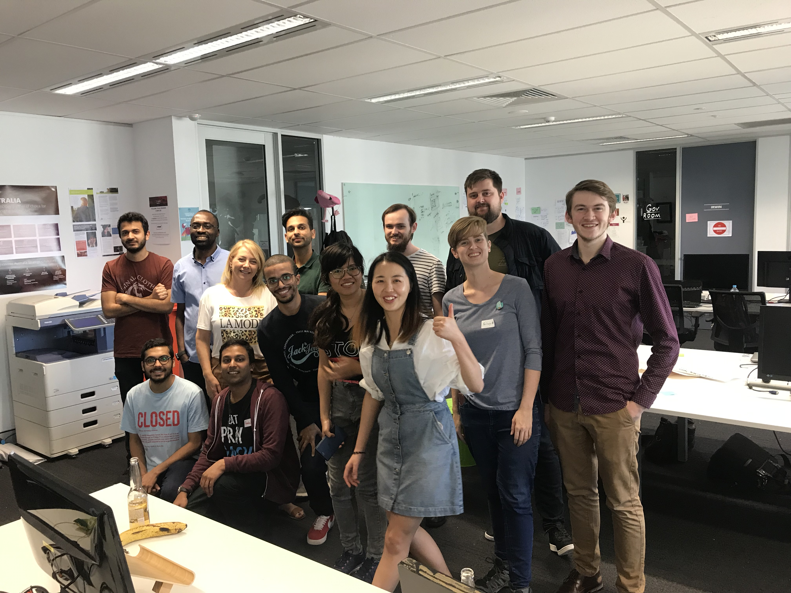

# MantisStripTester
MantisStripTester is a tool for analysing colour strip tests (dipsticks).
This prototype was developed as part of [Health Hack 2019](https://www.healthhack.com.au/).
We developed a smart phone app which can be used to
interpret the result of a dipstick.

## Problem overview
It is a common practice in developing countries for a medical
laboratory professionals and clinicians to use a dipstick to
detect and interpret a suspected disease like malaria using the naked eye. 

This visual interpretation has been shown to be unreliable or inconsistent, because it could be interpreted differently by different testers. For example, 100 to 1,000 copies of DNA per microlitre could be interpreted as either positive or negative depending on the person viewing it.  Also, the interpretation of the dipstick lines cannot tell the health professionals an estimate of the amount of the disease that is present in the body fluid before, during and after treatment of the disease. 

This sort of problem could lead to inaccurate diagnosis for the patient, and inability of the clinicians to monitor treatment in order to determine a successful outcome. The lack of treatment follow-up poses a challenge to assess antibiotics sensitivity or resistance from specific infectious disease.

## Potential difficulties
The main problem would be developing a tool which could rhobustly classify images
of the test strips under different lighting conditions and variations
between different devices (phone models).

There are a range of existing solutions to this problem, some involving the use
of additional hardware or focussing on controlling the environmental conditions.
Further reading:
* https://www.osapublishing.org/ao/viewmedia.cfm?uri=ao-56-1-84&seq=0
* https://www.mathworks.com/company/newsletters/articles/machine-learning-for-colorimetric-analysis-of-saliva-alcohol-test-Strips.html
* https://pubs.rsc.org/en/content/articlelanding/2017/an/c7an00741h
* https://link.springer.com/article/10.1007/s40820-019-0239-3

## Our solution
For processing the images, we developed two solutions:

1. [ClassificationTests](ClassificationTests) contains files for training
   a artificial neural network.
   The network required labeled images to be trained on, 
   [ClassificationTests/Images/](ClassificationTests/Images/) contains images
   which have been classified as either positive or negative.
   The network can be trained on these iamges and also augmented images (random
   rotations, scaling, skew, distortions, ...).
2. [ImageProcessing](ImageProcessing) contains a solution based on traditional
   image processing.  The method looks at the integrated intensity of the two colour
   lines.  By looking at the different colour components it is possible to
   classify the two strips.
   
For the user interface we developed a [react-native](https://facebook.github.io/react-native/)
app that can run on iOS and Android, this is contained in the [mantisUi](mantisUi) directory.
We had difficulty connecting the trained neural network to the react-native ui.
There are a range of packages for linking but there is a lack of good documentation
or tutorials.
In order to get a working proto-type by the end of the weekend, we developed
an Android-only version [tfliteAndroid](tfliteAndroid).
The Android version currently doesn't print the result to the screen, instead it
outputs to the developer console.
[docs/ui_plan.jpg](docs/ui_plan.jpg) shows a potential UI layout, this is partially
implemented in the react-native version of the app.
[docs/Introduction and Result.docx](Introduction and Result.docx) contains text
for the user interface.

## Future direction
In order to take this project forward, the following needs to be done:
* Finalise the user interface, including add the output text to the app
* Generate a labled data set with strip intensities, use these to train a
  neural network to quantify the strip intensities.
* Try other image processing techniques (maybe checkout ImageJ)
* Once the app is working, generate additional training data in a variety
  of different circumstances by using the app to collect video of strips
  with pre-determined intensities.
* Integrate tensorflow lite (or another alternative) with react-native
   or develop a iOS version of the app with tensorflow

## Contributors

* Ameh James (Problem Owner)
* Ali Abdelghany
* Bavani Tam
* Divjyot Singh
* Fei Yang
* Harsh Pandya
* Isaac Tucker
* Kelsey McGahan
* Matthew Martin
* Pritii Tam Wai Yin
* Randall Fernando
* Roxana Perez
* Isaac Lenton

## License
All the code for this weekend was released under the MIT license.  See [LICENSE](LICENSE) for details.
